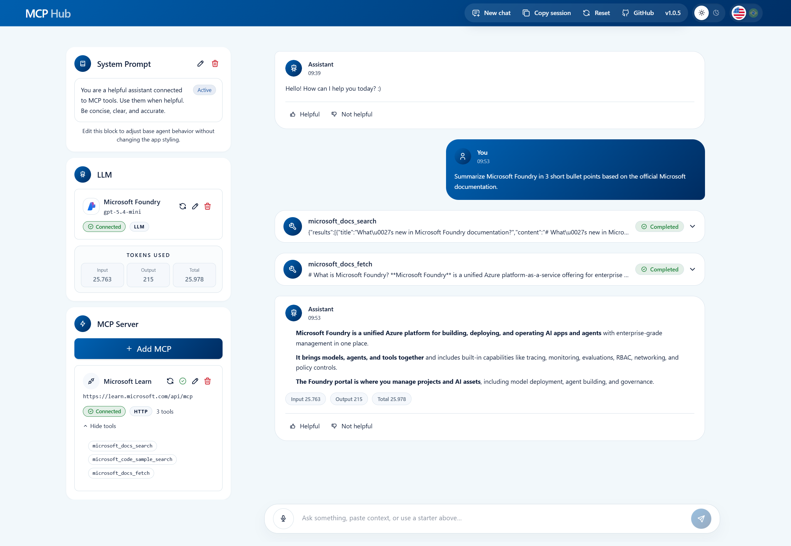

# MCP Hub

[](https://www.npmjs.com/package/@thiagorufino/mcp-hub)
[](https://www.npmjs.com/package/@thiagorufino/mcp-hub)

**MCP Hub** is a local web UI for testing LLMs and MCP servers. Connect providers, inspect tool calls, and run multi-turn chats in one place.



---

## Architecture Overview

```
┌──────────────────────────────────────────────┐
│                  Browser UI                  │
│        (Next.js App Router + shadcn/ui)      │
└─────────────────────┬────────────────────────┘
                      │
┌─────────────────────▼────────────────────────┐
│           Next.js Server (local)             │
│                                              │
│  ┌──────────────────┐  ┌──────────────────┐  │
│  │    AI Routes     │  │    MCP Routes    │  │
│  │  Vercel AI SDK   │  │  @mcp/sdk client │  │
│  └────────┬─────────┘  └────────┬─────────┘  │
└───────────┼─────────────────────┼────────────┘
            │                     │
┌───────────▼────────┐  ┌─────────▼────────────┐
│   LLM Providers    │  │     MCP Servers      │
│   (10 providers)   │  │  stdio / SSE / HTTP  │
└────────────────────┘  └──────────────────────┘
```

MCP Hub consists of two components that work together:

**MCP Hub Server**: A Next.js standalone server that runs locally via `npx`. It acts as the bridge between the browser and external services, spawning MCP stdio processes, connecting to remote MCP servers over SSE or Streamable HTTP, and forwarding LLM requests to the configured provider.

**MCP Hub Client**: A React-based web UI served by the local server. It provides the interface for configuring providers, managing MCP connections, inspecting tool schemas, and running multi-turn chats with live tool call traces.

All traffic stays on `localhost` except direct calls to the LLM providers you configure.

---

## Table of Contents

- [Quick Start](#quick-start)
- [Features](#features)
  - [LLM Providers](#llm-providers)
  - [MCP Servers](#mcp-servers)
  - [Chat](#chat)
- [Stack](#stack)
- [Security](#security)
- [Limitations](#limitations)
- [Links](#links)

---

## Quick Start

```bash
npx @thiagorufino/mcp-hub
```

Starts on `http://127.0.0.1:3000` by default and opens the browser automatically. If the port is already taken, the CLI picks the next free local port.

To update to the latest version:

```bash
npx @thiagorufino/mcp-hub@latest
```

```bash
# Custom port
npx @thiagorufino/mcp-hub --port 4010

# Bind explicitly to localhost without auto-opening the browser
npx @thiagorufino/mcp-hub --host localhost --port 3000 --no-open

# IPv6 loopback is also allowed
npx @thiagorufino/mcp-hub --host ::1

# Show all options
npx @thiagorufino/mcp-hub --help
```

**Requires Node.js 20+**

The public CLI refuses non-local host binding. Allowed hosts: `127.0.0.1`, `localhost`, `::1`.

---

## Features

### LLM Providers

Configure any of the 10 supported providers directly in the UI:

| Provider | Supported |
|---|:---:|
| Anthropic | ✅ |
| AWS Bedrock | ✅ |
| DeepSeek | ✅ |
| Google Gemini | ✅ |
| Groq | ✅ |
| Microsoft Foundry | ✅ |
| Mistral AI | ✅ |
| Ollama | ✅ |
| OpenAI | ✅ |
| xAI | ✅ |

### MCP Servers

Connect to MCP servers over all three transports:

| Transport | Description |
|---|---|
| **stdio** | Local process spawned by the app |
| **SSE** | Remote server-sent events endpoint |
| **Streamable HTTP** | Modern MCP transport |

Inspect tools, schemas, and execute calls directly from the sidebar.

- Remote MCP auth support: custom headers or OAuth 2.0 when the server requires it
- OAuth discovery follows MCP protected-resource metadata and authorization-server metadata
- Discovery fallback supports root metadata, path-based metadata such as `/mcp`, and `WWW-Authenticate` hints

- Automatic health revalidation: MCP status updates when a server goes offline or comes back
- Per-server recovery logic: one failing MCP does not block others from being revalidated
- Manual retest controls: force validation whenever you want from the sidebar

### Chat

- Streaming responses with live token display
- Multi-turn conversation history
- System Prompt support
- Token usage tracking: input, output, and total tokens per message and accumulated per session
- Tool activity trace: see every MCP tool call and result in real time
- Chart rendering: ask for charts, get interactive visualizations inline
- Audio input support
- MCP-aware chat requests: fresh validated MCP snapshot before exposing tools to the model

---

## Stack

| Layer | Technology |
|---|---|
| Framework | Next.js 16 (App Router, standalone output) |
| AI | Vercel AI SDK 6, unified streaming across all providers |
| MCP | @modelcontextprotocol/sdk |
| UI | Tailwind CSS 4 + Radix UI + shadcn/ui |
| Icons | @lobehub/icons, official AI provider brand icons |

---

## Security

Runs locally on loopback interfaces only. Credentials are sent only to providers you configure and never stored in any remote backend.

- LLM credentials and MCP auth headers/env stored only in browser `sessionStorage`
- OAuth state, tokens, and related MCP auth config stay in browser session storage too
- Closing the tab clears all sensitive config
- Chat history and non-sensitive UI preferences may persist locally
- MCP `stdio` servers are spawned as child processes, so only connect to servers you trust
- CLI refuses non-local host binding by design

See [SECURITY.md](./SECURITY.md) for the full security model.

---

## Limitations

- CLI app distributed via npm, not a library API
- First launch downloads the standalone Next.js bundle, which may take a moment
- Provider credentials are session-scoped, so you must re-enter them in new browser sessions
- Remote MCP OAuth config is also session-scoped, so re-auth may be needed after session end
- Remote multi-user deployment is out of scope

---

## Links

- GitHub: https://github.com/thiagorufino1/mcp-hub
- Issues: https://github.com/thiagorufino1/mcp-hub/issues
- npm: https://www.npmjs.com/package/@thiagorufino/mcp-hub

## License

Apache License 2.0. See [LICENSE](./LICENSE).
